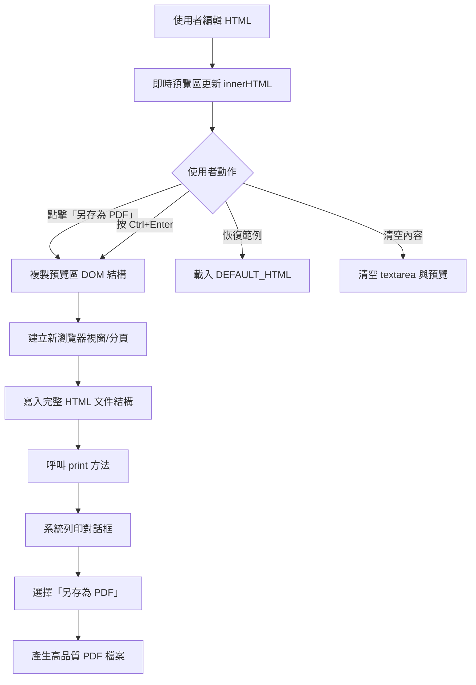
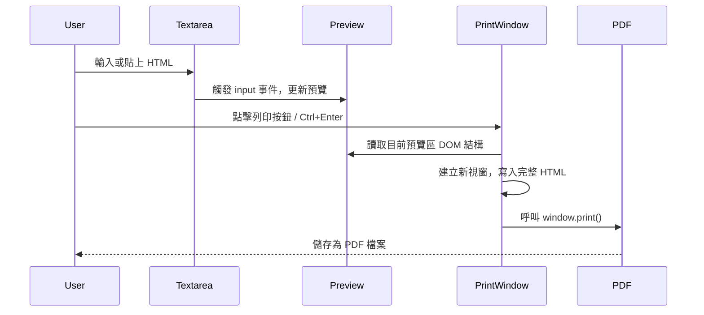

# 📄 HTML 轉 PDF 工具 — 專案說明

**線上體驗**：https://mcc-mak.github.io/html-to-pdf-converter/
  
**特別情況（Markdown）**：https://markdownviewer.org/

## 概述

這是一個純前端、零依賴的網頁工具，讓使用者編寫或貼上 HTML 程式碼，透過**瀏覽器原生列印機制**將內容轉換為高品質 PDF 檔案。  
捨棄複雜的 `html2canvas` + `jsPDF` 方案，改用 `window.print()` 路線，確保排版、圖片、字型完美保留。

---

## 主要功能

| 功能 | 說明 |
|------|------|
| ✍️ HTML 原始碼編輯 | 左側文字區支援手動輸入或貼上任何 HTML 內容 |
| 👁️ 即時預覽 | 右側區域即時渲染 HTML，所見即所得 |
| 🖨️ 另存為 PDF | 點擊按鈕或按 `Ctrl+Enter`，開啟瀏覽器列印對話框 → 選擇「另存為 PDF」 |
| 📋 恢復範例 | 一鍵載入內建優雅範例，方便測試與學習 |
| 🧹 清空內容 | 清空編輯區與預覽區，重新開始 |
| 📱 響應式設計 | 支援電腦、平板與手機瀏覽 |

---

## 技術架構

---

## 核心邏輯流程（簡化）

---

## 檔案結構

| 檔案 | 說明 |
|------|------|
| `index.html` | 單一檔案包含所有結構、樣式、邏輯，無需外部資源 |

---

## 使用技術

| 技術 | 用途 |
|------|------|
| HTML5 | 頁面結構與語意標籤 |
| CSS3 | 視覺裝飾、卡片陰影、漸層背景、響應式佈局（Flexbox） |
| JavaScript (ES6) | DOM 操作、事件監聽、動態預覽、新視窗列印 |
| `window.print()` | 原生瀏覽器列印 API，用於產生 PDF |

> **注意**：本工具完全無需任何外部套件或 CDN，離線也可正常運作。

---

## 操作快速指南

| 步驟 | 操作 | 說明 |
|------|------|------|
| 1 | 在左側文字區輸入 HTML | 支援任何 HTML 標籤、內嵌 CSS、圖片等 |
| 2 | 觀察右側即時預覽 | 自動同步更新，確認版面正確 |
| 3 | 點擊「🖨️ 另存為 PDF」或按 `Ctrl+Enter` | 開啟瀏覽器列印視窗 |
| 4 | 在列印對話框中選擇「目的地」→「另存為 PDF」 | 可調整版面、邊距、頁首頁尾 |
| 5 | 點擊「儲存」按鈕 | 產生並下載 PDF 檔案 |

---

## 內建範例說明

當使用者點擊「恢復範例」按鈕時，會載入以下結構的示範內容：

| 區塊 | 內容 |
|------|------|
| 標題區 | 彩色邊框標題 |
| 說明段落 | 介紹工具特性 |
| 表格 | 響應式佈局、列印最佳化、圖片保留三項功能 |
| 引用區塊 | 提示如何使用瀏覽器列印 |
| 結尾註解 | 純前端、安全可靠 |

---

## 自訂與擴充建議

| 需求 | 建議修改位置 |
|------|--------------|
| 更改預設範例內容 | 修改 `DEFAULT_HTML` 常數值 |
| 調整列印時頁面邊距 | 修改 `printWindow.document.write` 中的 `@media print` 樣式區塊 |
| 修改按鈕顏色或圓角 | 調整 `.btn`、`.btn-primary` 等 CSS 類別 |
| 新增額外按鈕（例如匯出 HTML） | 於 `.action-bar` 內新增按鈕並綁定事件 |

---

## 相容性

| 瀏覽器 | 支援狀況 |
|--------|----------|
| Google Chrome | ✅ 完全支援 |
| Mozilla Firefox | ✅ 完全支援 |
| Microsoft Edge | ✅ 完全支援 |
| Safari | ✅ 完全支援（Mac / iOS） |
| Opera | ✅ 完全支援 |

> 需允許瀏覽器彈出視窗（用於列印預覽新視窗），否則按鈕可能無反應並顯示提示。

---

## 常見問題

| 問題 | 解決方式 |
|------|----------|
| 點擊按鈕後無反應 | 檢查瀏覽器是否封鎖彈出視窗，請允許彈出視窗 |
| 產生的 PDF 排版跑掉 | 使用瀏覽器列印時，可調整「邊界」為「預設」或「無」，並取消「頁首頁尾」 |
| 圖片無法顯示 | 請確保圖片使用絕對路徑或可公開存取網址，本地圖片需轉為 Base64 或使用線上圖床 |
| 文字過小 | 在列印對話框中調整「縮放比例」或使用 CSS `@media print` 設定更大字體 |

---

## 授權與備註

- 本工具為**純前端展示**，無任何後端傳輸，所有資料僅在使用者瀏覽器中處理。
- 可自由修改、散佈，無授權限制（MIT 風格）。
- 建議搭配現代瀏覽器以獲得最佳體驗。
